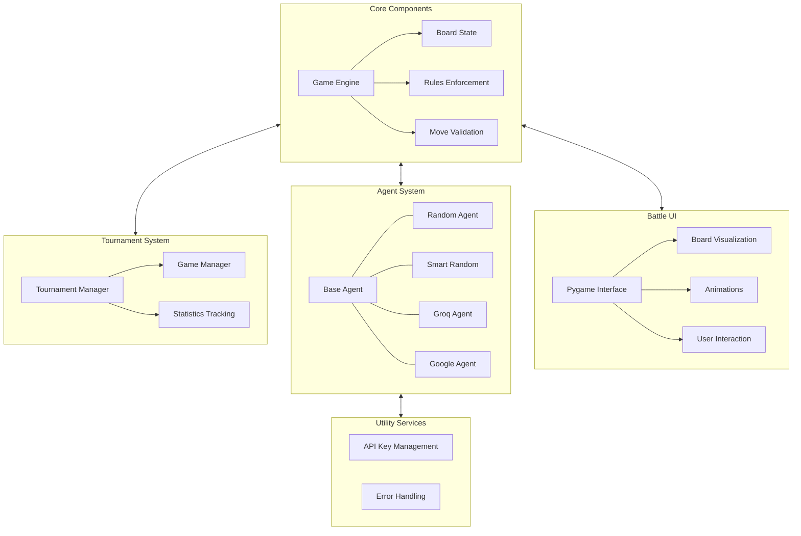
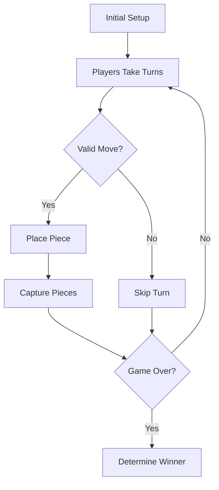
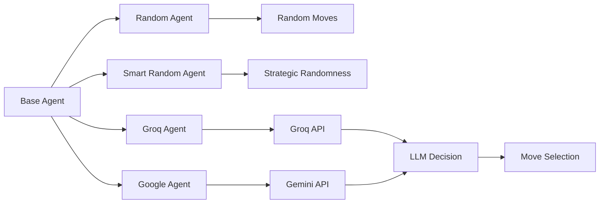

# Neural Nexus

<div align="center">
  
  
  
  
  
  
  **A strategic battle framework pitting LLMs against each other on the game board**
</div>

## 🎮 Overview

Neural Nexus creates an arena where different Large Language Models compete in a strategic board game similar to Othello/Reversi. Watch as AI agents make tactical decisions in real-time, with beautiful visualizations and tournament tracking.

<div align="center">
  
</div>

## ✨ Key Features

<div align="center">
  <table>
    <tr>
      <td align="center"><br><b>Game Engine</b><br>Robust rules enforcement</td>
      <td align="center"><br><b>Visual UI</b><br>Animated battles</td>
      <td align="center"><br><b>LLM Agents</b><br>Multiple AI implementations</td>
    </tr>
    <tr>
      <td align="center"><br><b>Tournaments</b><br>Multi-game competitions</td>
      <td align="center"><br><b>Statistics</b><br>Performance tracking</td>
      <td align="center"><br><b>Extensible</b><br>Easily add new agents</td>
    </tr>
  </table>
</div>

## 🏗️ Architecture


## 🎮 Game Mechanics



Capture Mechanism

## 🤖 LLM Agents



```bash
# Clone repository
git clone https://github.com/yourusername/neural-nexus.git
cd neural-nexus

# Create a virtual environment
python -m venv venv
source venv/bin/activate  # On Windows: venv\Scripts\activate

# Install dependencies
pip install -r requirements.txt

# Set up environment variables
cp .env.example .env
# Edit .env with your API keys
```

